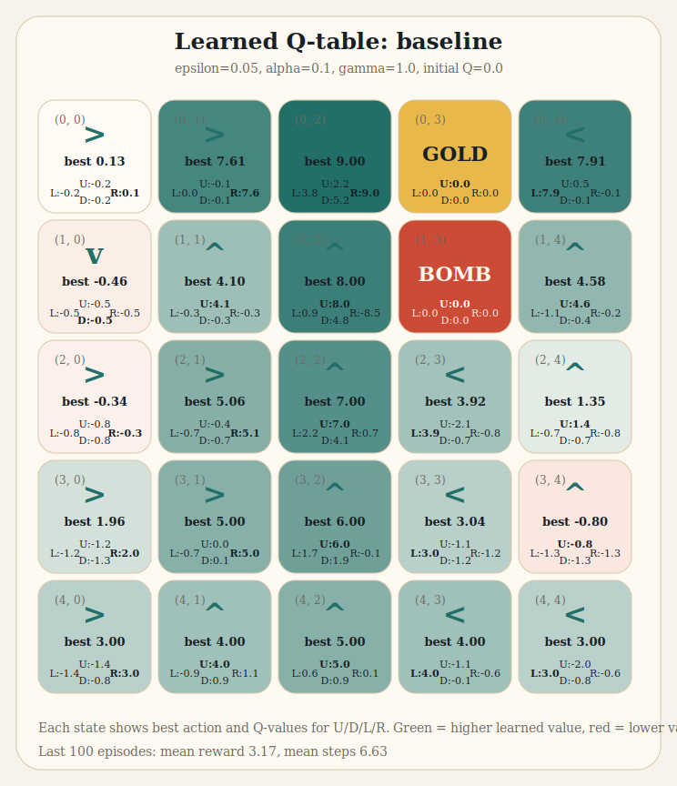
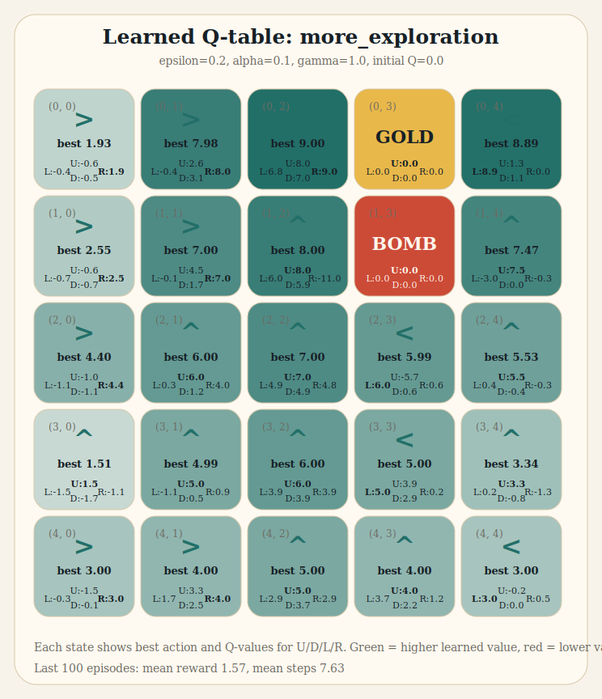
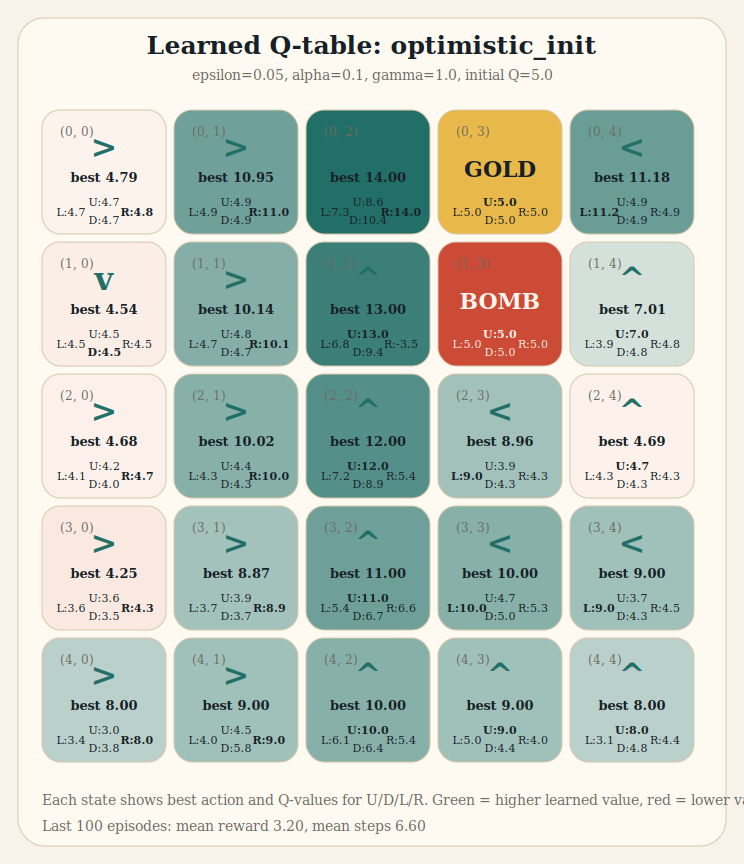
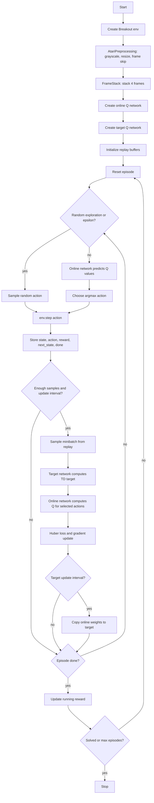

# Intelligent Control Mid-term Takehome 2026

## 合法使用與引用說明

本作業只引用公開資料與重新實作必要實驗，不直接複製未授權程式碼。

| 資源 | 使用方式 | 授權/風險判斷 |
|---|---|---|
| michaeltinsley Gridworld Q-learning | 參考題目公開片段與 README 的環境描述，`scripts/q_learning_gridworld.py` 為自行重新實作 | GitHub 頁面未顯示 LICENSE，因此不複製原 notebook 程式碼 |
| Keras Deep Q-Learning for Atari Breakout | 參考 Keras 範例的 DQN workflow 與原始 CNN baseline；本作業另寫 `scripts/dqn_dueling_variant.py` | keras-io GitHub 頁面顯示 Apache-2.0 license |
| kzl/decision-transformer | 參考 README 與論文概念撰寫第 3 題 | GitHub 頁面顯示 MIT license |

主要引用：

- Gridworld repo: https://github.com/michaeltinsley/Gridworld-with-Q-Learning-Reinforcement-Learning-/tree/master
- Keras Breakout example: https://keras.io/examples/rl/deep_q_network_breakout/
- keras-io source repo: https://github.com/keras-team/keras-io
- Decision Transformer repo: https://github.com/kzl/decision-transformer
- Mnih et al. 2013, Playing Atari with Deep Reinforcement Learning: https://arxiv.org/abs/1312.5602
- Wang et al. 2016, Dueling Network Architectures for Deep RL: https://arxiv.org/abs/1511.06581
- Chen et al. 2021, Decision Transformer: https://arxiv.org/abs/2106.01345

---

## 1. Gridworld Reinforcement Learning

### 1.1 Q-learning 程式片段的數學式與說明

題目程式：

```python
def learn(self, old_state, reward, new_state, action):
    q_values_of_state = self.q_table[new_state]
    max_q_value_in_new_state = max(q_values_of_state.values())
    current_q_value = self.q_table[old_state][action]
    self.q_table[old_state][action] = (1 - self.alpha) * current_q_value + self.alpha * (reward + self.gamma * max_q_value_in_new_state)
```

令舊狀態為 $s_t$，動作為 $a_t$，執行後得到 reward $r_{t+1}$ 與新狀態 $s_{t+1}$。更新式為：

$$
Q_{new}(s_t,a_t)=(1-\alpha)Q(s_t,a_t)+\alpha\left[r_{t+1}+\gamma\max_{a'}Q(s_{t+1},a')\right]
$$

等價寫法：

$$
Q_{new}(s_t,a_t)=Q(s_t,a_t)+\alpha\left(r_{t+1}+\gamma\max_{a'}Q(s_{t+1},a')-Q(s_t,a_t)\right)
$$

其中：

- $Q(s,a)$：在狀態 $s$ 採取動作 $a$ 後，預期可得到的累積回報。
- $\alpha$：learning rate。越大代表越快相信新樣本，但也更容易震盪。
- $\gamma$：discount factor。越接近 1，越重視長期 reward。
- $\max_{a'}Q(s_{t+1},a')$：假設下一狀態之後採取目前估計的最佳動作，這也是 Q-learning 的 off-policy 特性。
- 括號中的 $r_{t+1}+\gamma\max Q$ 是 TD target；target 與目前估計的差距是 TD error。

### 1.2 三種以上初始設定的 Q-table 結果與討論

實驗使用本 repo 的自行實作：`scripts/q_learning_gridworld.py`。環境是 5x5 grid，gold 在 `(0,3)`，bomb 在 `(1,3)`，底部列隨機起點；每步 -1，到 gold 額外 +10，到 bomb 額外 -10；每組訓練 1000 episodes，固定 seed `20260425`。

輸出檔：`docs/gridworld_results.csv`。

| 設定 | epsilon | alpha | gamma | initial Q | 後 100 回合平均 reward | 後 100 回合平均步數 | 解讀 |
|---|---:|---:|---:|---:|---:|---:|---|
| baseline | 0.05 | 0.10 | 1.00 | 0.0 | 3.17 | 6.63 | 穩定收斂到接近最短路徑；少量探索足夠避免初期 tie-breaking 偏差 |
| more_exploration | 0.20 | 0.10 | 1.00 | 0.0 | 1.57 | 7.63 | 探索率高，訓練後期仍常做隨機動作，因此平均 reward 較差、步數較長 |
| optimistic_init | 0.05 | 0.10 | 1.00 | 5.0 | 3.20 | 6.60 | 樂觀初始值鼓勵早期嘗試未探索動作，最後表現與 baseline 接近或稍好 |
| faster_learning | 0.05 | 0.30 | 1.00 | 0.0 | 2.88 | 6.52 | 較大的 learning rate 讓學習較快，但單次樣本影響更大，reward 稍低 |

以下用圖片呈現三組設定訓練完成後的 learned Q-table。每個格子是一個 state，中央箭頭是該 state 的 greedy action，周圍 `U/D/L/R` 是四個 action 的 Q-value。綠色代表較高 learned value，紅色代表較低 learned value；`GOLD` 與 `BOMB` 是 terminal states。完整數值另存於 `docs/gridworld_q_tables.csv`。

#### Learned Q-table: `baseline`



#### Learned Q-table: `more_exploration`



#### Learned Q-table: `optimistic_init`



從 learned Q-table 可直接看出：靠近 gold 的動作 Q-value 最高，例如 `(0,2)` 的 `RIGHT` 會進入 gold，因此三組設定都學到最高值；靠近 bomb 的危險動作會被壓低，例如 `(1,2)` 的 `RIGHT` 指向 bomb，因此 Q-value 明顯偏低。`more_exploration` 因為 epsilon 較高，訓練後期仍持續隨機探索，平均 reward 較差；`optimistic_init` 的 Q 值整體較高，是因為初始值為 5.0，但 greedy action 仍大致指向較佳路徑。

### 1.3 Random Agent 與 Q-Agent 的表現差異原因

Random Agent 每一步都從四個動作中均勻抽樣，不會記住過去哪些路徑會靠近 gold 或碰到 bomb。因此它的 expected reward 主要取決於隨機遊走是否剛好進入 terminal state，常出現繞路、撞牆、甚至走向 bomb。

Q-Agent 會透過 TD target 更新 `Q(state, action)`，把「走向 gold 的路徑」累積成較高 Q-value，把「導向 bomb 或浪費步數的動作」壓成較低 Q-value。訓練後，epsilon-greedy 的主要行為是選擇 Q-table 中估計值最高的動作，只保留少量探索。因此 Q-Agent 的平均步數更短、撞 bomb 機率更低、平均 reward 更高。

---

## 2. Deep Q-Learning for Atari Breakout

### 2.1 程式目的

Keras 範例的目的是在 `BreakoutNoFrameskip-v4` 上訓練 Deep Q-Network。它把 Atari 畫面前處理成 84x84 灰階 frame，堆疊 4 張 frame 當作 state，使用 CNN 近似 $Q(s,a)$，再用 epsilon-greedy、experience replay、target network 與 Huber loss 訓練 agent 控制板子接球、打磚塊並最大化遊戲分數。

### 2.2 為何 Q-learning 能達成任務目標

Breakout 的每個 action 會影響球、板子與磚塊後續狀態；短期得分與長期能否維持球不掉落都會反映在累積 reward。Q-learning 學的是：

$$
Q^*(s,a)=\mathbb{E}\left[r_{t+1}+\gamma\max_{a'}Q^*(s_{t+1},a')\right]
$$

只要 CNN 能從影像中抽出球的位置、板子位置、速度方向與磚塊分布，輸出層就能估計每個 action 的長期價值。agent 選 $\arg\max_a Q(s,a)$ 時，會偏向「讓球回彈、打掉更多磚塊、避免失誤」的動作。experience replay 降低連續影像樣本的相關性，target network 則降低 bootstrap target 持續變動造成的不穩定。

### 2.3 程式結構與流程圖



### 2.4 CNN 變體：Dueling DQN

我提供的變體在 `scripts/dqn_dueling_variant.py`。它保留原始 DQN 的 convolutional feature extractor，但把 fully connected head 改成兩條支路：

$$
Q(s,a)=V(s)+A(s,a)-\frac{1}{|\mathcal{A}|}\sum_{a'}A(s,a')
$$

其中 $V(s)$ 估計狀態本身價值，$A(s,a)$ 估計各 action 相對優勢。減去 advantage 平均值是為了避免 $V$ 和 $A$ 任意平移導致不可識別。

變更重點：

- 原始 CNN head：`Flatten -> Dense(512) -> Dense(num_actions)`。
- Dueling head：`Flatten -> value stream + advantage stream -> combine Q-values`。
- 訓練 loop 不必改；仍可用同一套 replay buffer、target network、epsilon-greedy 與 TD target。

結果與說明：

| 模型 | 本作業狀態 | 預期/文獻依據 |
|---|---|---|
| 原始 Keras DQN | Keras 文件說明約 10M frames 可得到好結果，完整 Atari 訓練通常需長時間 GPU | baseline CNN 直接估計每個 action 的 Q-value |
| Dueling DQN 變體 | 已提供可替換模型 factory；本機未執行 10M frames 完整訓練 | Wang et al. 提出 dueling architecture 可分離 state value 與 action advantage，在許多 action 價值接近的 Atari 狀態中改善 policy evaluation |

嚴格來說，要宣稱「本機實驗已超越原版」需要用相同 seed、frame budget、evaluation episodes 比較平均分數。這份學習紀錄已提供合法可重現的變體程式，但未偽造長時間 Atari 分數。若要補完整實驗，建議至少用 3 個 seeds、固定 1M/5M/10M frames checkpoint，報告 mean episode return 與標準差。

---

## 3. Decision Transformer

### 3.1 DT 基本概念與傳統 RL 的差異

Decision Transformer 把 reinforcement learning 改寫成 sequence modeling。它不直接估計 value function，也不透過 policy gradient 最大化期望回報，而是把 trajectory 表示成序列：

$$
(\hat{R}_1, s_1, a_1, \hat{R}_2, s_2, a_2, \ldots)
$$

其中 $\hat{R}_t$ 是 return-to-go。模型使用 causal Transformer，根據「目標 return、過去 states、過去 actions」預測下一個 action。

與 Q-learning 的差異：

| 面向 | Q-learning / DQN | Decision Transformer |
|---|---|---|
| 學習目標 | 學 $Q(s,a)$，用 Bellman target bootstrap | 學條件式 action prediction |
| 資料形式 | 可 online 與環境互動，也可 off-policy | 主要是 offline trajectory dataset |
| 決策方式 | 選 $\arg\max_a Q(s,a)$ | 給定 desired return，autoregressive 產生 action |
| 核心模型 | table / CNN / MLP 估計 value | Transformer 建模序列依賴 |
| 是否需要 Bellman backup | 需要 | 不需要 |

### 3.2 Return-to-go 定義

Return-to-go 是從時間 $t$ 開始到 episode 結束的未來 reward 總和：

$$
\hat{R}_t=\sum_{t'=t}^{T} r_{t'}
$$

若使用 discount，也可寫成：

$$
\hat{R}_t=\sum_{k=0}^{T-t}\gamma^k r_{t+k}
$$

在 DT 中，return-to-go 是條件輸入。推論時可以指定一個較高的 target return，模型便嘗試產生過去資料中與高回報 trajectory 類似的 action 序列。每執行一步後，目標 return 通常會扣掉實際得到的 reward，形成下一步的條件。

### 3.3 為何 DT 不依賴 value function 或 policy gradient

DT 的訓練本質是 supervised learning：給定過去 token 與 target return，最小化預測 action 與資料集中真實 action 的誤差。對離散 action 可用 cross-entropy，對連續 action 可用 MSE 或 likelihood 類 loss。

因此它不需要：

- value function：不估 $V(s)$ 或 $Q(s,a)$，也不用 Bellman equation 建 target。
- policy gradient：不需要估計 $\nabla_\theta \mathbb{E}[R]$，也不用 advantage estimator。
- online exploration：訓練可完全從 offline trajectories 完成。

它能做決策，是因為 return-to-go conditioning 把「想要多高回報」變成模型輸入，Transformer 再從資料中學到能達到該回報的行為模式。

### 3.4 DT 的限制

DT 至少有以下限制：

- 資料品質依賴高：若 offline dataset 幾乎沒有高回報 trajectory，模型很難憑空產生比資料更好的策略；指定過高 target return 可能造成 out-of-distribution action。
- sequence length 敏感：context 太短會看不到長期依賴；context 太長會增加 Transformer 記憶體與計算成本，也可能引入無關歷史。
- offline setting 風險：DT 不主動探索環境，因此無法像 online RL 一樣透過 trial-and-error 發現 dataset 外的新策略。
- reward scaling 重要：return-to-go 是輸入 token；不同 task 的 reward 尺度差異大時，需正規化或調整 target return，否則模型條件可能失真。

### 3.5 為何 DT 有時能超越傳統 RL，並提出改進

DT 有時能超越傳統 RL 的原因：

- 避免 bootstrapping error：傳統 value-based offline RL 容易對 dataset 外 action 產生過度樂觀 Q-value；DT 不直接最大化 Q，因此較少受 extrapolation error 影響。
- 善用長序列關係：Transformer 能利用長期 history，例如早期選擇如何影響後期 reward。
- 條件式控制彈性：同一模型可用不同 target return 產生不同行為強度，類似把 planning objective 放進輸入。
- 訓練穩定：supervised learning 通常比 online RL 的高變異 gradient 或 moving Bellman target 更穩。

一個可行改進：加入 trajectory quality-aware sampling。訓練時不要平均抽樣所有 trajectories，而是提高高回報、多樣化且接近目標任務分布的片段比例，同時保留部分中低回報樣本避免過度模仿單一路徑。具體做法可以是：

$$
p(\tau_i) \propto \exp(\beta \cdot normalized\_return(\tau_i)) + \lambda \cdot diversity(\tau_i)
$$

這樣能讓模型更常看到成功策略，同時避免只記住少數 high-return trajectory。若搭配 conservative data augmentation，例如 state noise、random crop 或 action dropout，也能提升泛化能力。
